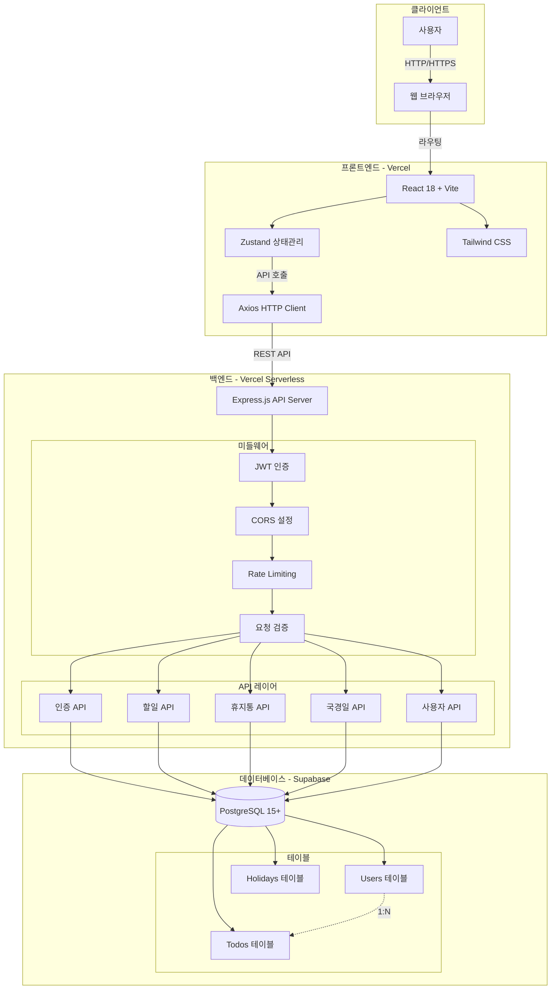
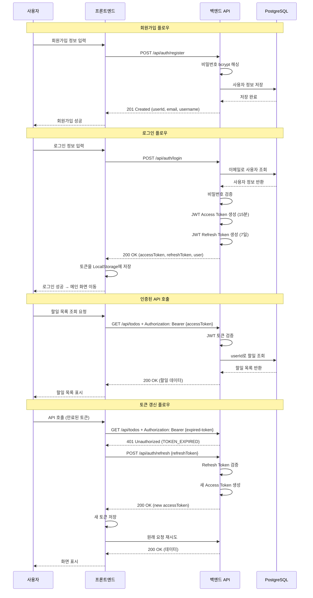
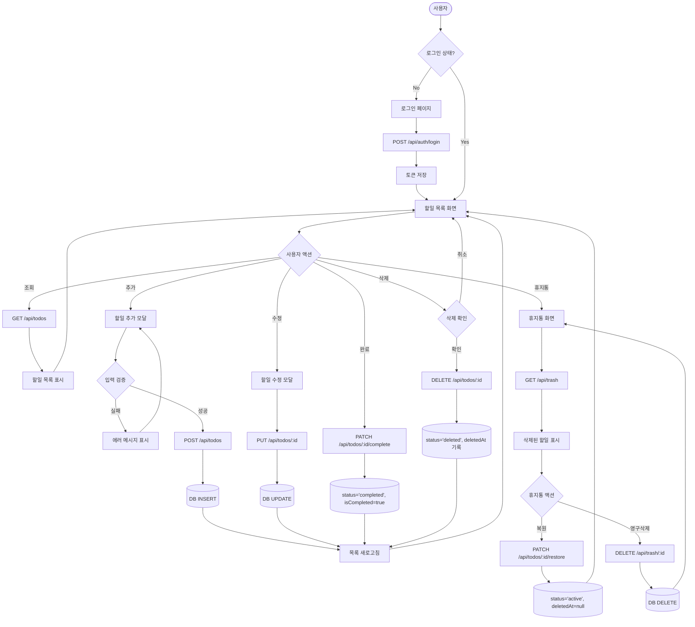
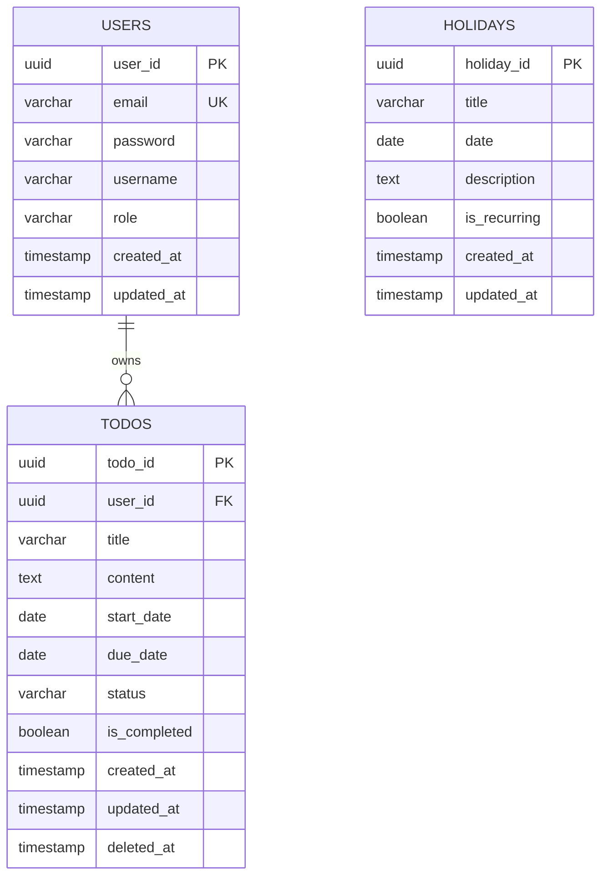
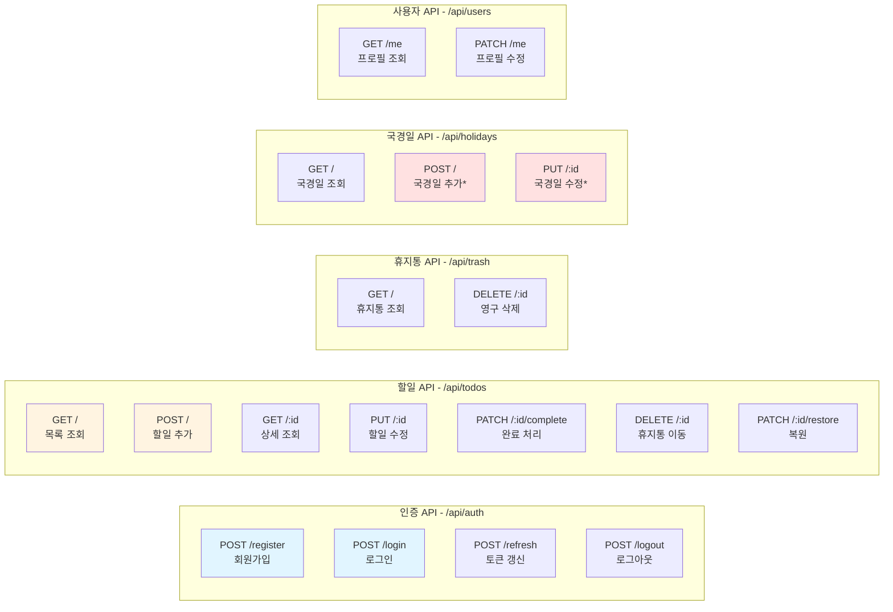
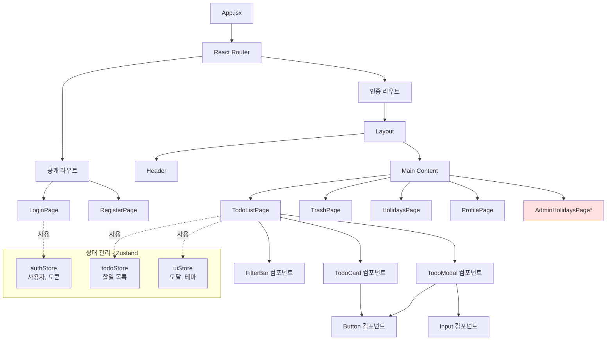
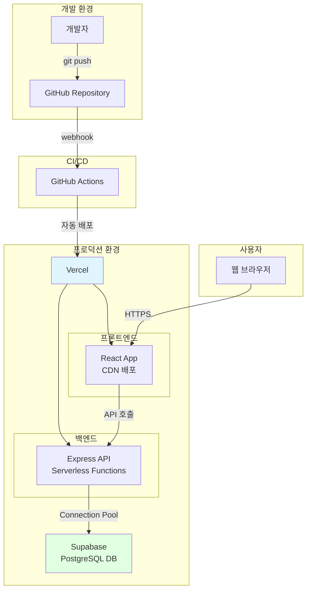
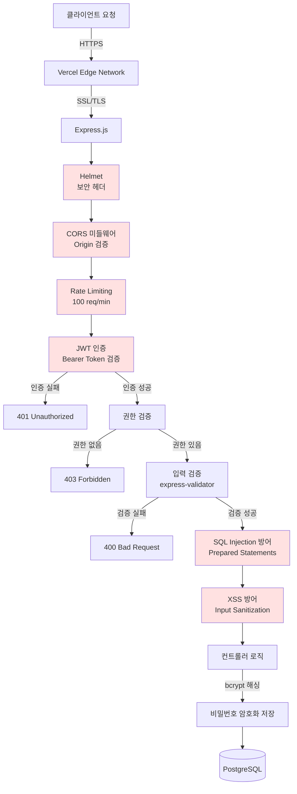

# WHS-TodoList 기술 아키텍처 다이어그램

**버전**: 1.0
**작성일**: 2025-11-26
**작성자**: Technical Writer
**참조 문서**: [PRD v1.0](./3-prd.md)

---

## 시스템 아키텍처 개요

WHS-TodoList는 3-Tier 아키텍처를 기반으로 한 웹 애플리케이션입니다.
- **프론트엔드**: React + Vite로 구성된 SPA (Single Page Application)
- **백엔드**: Express.js 기반 REST API 서버
- **데이터베이스**: Supabase PostgreSQL

---

## 전체 시스템 아키텍처

---

## 인증 흐름

---

## 할일 관리 플로우

---

## 데이터 모델 관계도

---

## API 엔드포인트 구조

_* 관리자 전용 API_

---

## 프론트엔드 컴포넌트 구조

_* 관리자 전용 화면_

---

## 배포 아키텍처

---

## 보안 레이어

---

## 주요 컴포넌트 설명

### 프론트엔드
- **React 18**: 사용자 인터페이스 구성
- **Zustand**: 경량 상태 관리 (인증, 할일, UI 상태)
- **Axios**: HTTP 클라이언트, 인터셉터로 토큰 자동 첨부
- **Tailwind CSS**: 유틸리티 우선 스타일링
- **React Router v6**: SPA 라우팅
- **React Hook Form + Zod**: 폼 관리 및 검증

### 백엔드
- **Express.js**: REST API 서버
- **JWT**: Access Token (15분) + Refresh Token (7일)
- **bcrypt**: 비밀번호 해싱 (salt rounds: 10)
- **express-validator**: 요청 데이터 검증
- **Helmet**: 보안 HTTP 헤더 설정
- **CORS**: Cross-Origin 요청 제어
- **Rate Limiting**: API 호출 제한 (100 req/min)

### 데이터베이스
- **PostgreSQL 15+**: 관계형 데이터베이스
- **Supabase**: PostgreSQL 호스팅 및 관리
- **Connection Pooling**: 효율적인 DB 연결 관리
- **인덱싱**: userId, status, dueDate, deletedAt
- **트랜잭션**: 데이터 무결성 보장

### 배포 및 인프라
- **Vercel**: 프론트엔드 및 백엔드 호스팅
- **Serverless Functions**: 백엔드 API 배포
- **Environment Variables**: 환경 변수 관리
- **Edge Network**: 전 세계 CDN 배포

---

## 데이터 흐름 예시

### 할일 추가 프로세스
1. 사용자가 할일 추가 모달에서 정보 입력
2. React Hook Form + Zod로 클라이언트 측 검증
3. Axios가 `POST /api/todos` 요청 (Authorization 헤더 자동 첨부)
4. Express 미들웨어: JWT 검증 → Rate Limit 확인 → 입력 검증
5. 컨트롤러: userId 추출, 비즈니스 로직 처리
6. PostgreSQL: INSERT INTO todos 실행
7. 응답 반환: 201 Created + 생성된 할일 데이터
8. Zustand 스토어 업데이트
9. UI 자동 리렌더링 → 새 할일 표시

### 토큰 갱신 프로세스
1. API 호출 시 Access Token 만료 (401 Unauthorized)
2. Axios 인터셉터가 자동으로 감지
3. `POST /api/auth/refresh` 호출 (Refresh Token 전송)
4. 백엔드: Refresh Token 검증 후 새 Access Token 발급
5. 새 토큰을 LocalStorage에 저장
6. 원래 API 요청 재시도
7. 성공 응답 반환

---

## 성능 최적화 전략

### 프론트엔드
- **코드 스플리팅**: React.lazy()로 페이지별 분할
- **Lazy Loading**: 이미지 및 컴포넌트 지연 로딩
- **번들 최적화**: Vite의 트리 쉐이킹 및 압축
- **메모이제이션**: React.memo, useMemo, useCallback 활용

### 백엔드
- **인덱싱**: 자주 조회되는 컬럼에 인덱스 생성
- **쿼리 최적화**: JOIN 최소화, 필요한 컬럼만 SELECT
- **Connection Pool**: DB 연결 재사용
- **캐싱**: 국경일 데이터 메모리 캐싱 (선택)

### 데이터베이스
- **인덱스 전략**:
  - `idx_todos_user_status`: 사용자별 할일 조회
  - `idx_todos_due_date`: 만료일 정렬
  - `idx_todos_deleted_at`: 휴지통 조회
- **제약 조건**: CHECK 제약으로 데이터 무결성 보장

---

## 확장 가능성

### 수평 확장
- Vercel Serverless Functions: 자동 스케일링
- Stateless 아키텍처: 서버 간 세션 공유 불필요
- JWT 토큰: 별도 세션 저장소 불필요

### 수직 확장
- Supabase PostgreSQL: 플랜 업그레이드로 성능 향상
- 인덱싱 및 쿼리 최적화로 대용량 데이터 처리

### 기능 확장 (2차 개발)
- 알림 기능 추가 (이메일/푸시)
- 캘린더 뷰 추가
- 협업 기능 (할일 공유)
- 통계 및 리포트
- 모바일 앱 (React Native)

---

**문서 종료**
