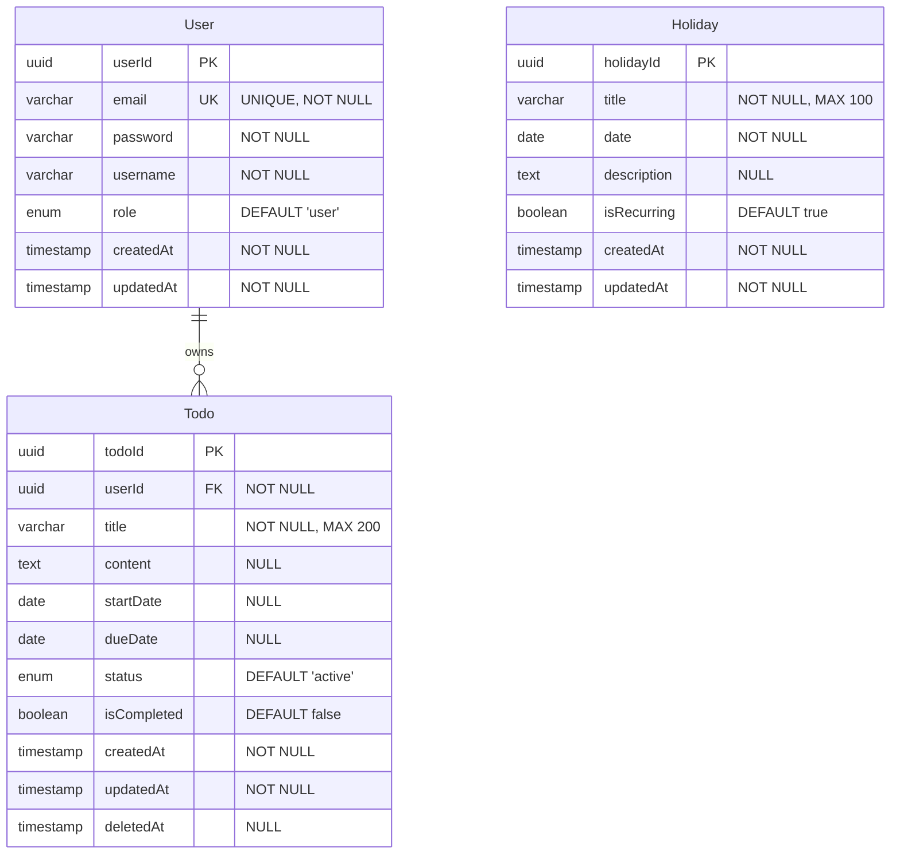

# WHS-TodoList 데이터 모델 및 ERD

**버전**: 1.0
**작성일**: 2025-11-26
**상태**: 최종
**참조 문서**:
- [도메인 정의서](./1-domain-definition.md)
- [PRD](./3-prd.md)

---

## 목차

1. [ERD (Entity Relationship Diagram)](#1-erd-entity-relationship-diagram)
2. [엔티티 상세](#2-엔티티-상세)
3. [데이터베이스 스키마 (SQL)](#3-데이터베이스-스키마-sql)

---

## 1. ERD (Entity Relationship Diagram)



---

## 2. 엔티티 상세

### 2.1 User (사용자)

| 필드 | 타입 | 제약 | 설명 |
|------|------|------|------|
| userId | UUID | PK | 사용자 고유 ID |
| email | VARCHAR(255) | UNIQUE, NOT NULL | 로그인 이메일 |
| password | VARCHAR(255) | NOT NULL | bcrypt 해시된 비밀번호 |
| username | VARCHAR(100) | NOT NULL | 사용자 이름 |
| role | ENUM('user', 'admin') | NOT NULL, DEFAULT 'user' | 사용자 역할 |
| createdAt | TIMESTAMP | NOT NULL | 가입일시 |
| updatedAt | TIMESTAMP | NOT NULL | 최종 수정일시 |

**인덱스**:
- PRIMARY KEY: userId
- UNIQUE INDEX: email
- INDEX: role (관리자 조회용)

**비즈니스 규칙**:
- 이메일은 유일해야 함 (중복 불가)
- 비밀번호는 bcrypt로 해싱하여 저장
- 기본 역할은 'user'

---

### 2.2 Todo (할일)

| 필드 | 타입 | 제약 | 설명 |
|------|------|------|------|
| todoId | UUID | PK | 할일 고유 ID |
| userId | UUID | FK, NOT NULL | 소유자 ID |
| title | VARCHAR(200) | NOT NULL | 할일 제목 |
| content | TEXT | NULL | 할일 상세 내용 |
| startDate | DATE | NULL | 시작일 |
| dueDate | DATE | NULL | 만료일 |
| status | ENUM('active', 'completed', 'deleted') | NOT NULL, DEFAULT 'active' | 할일 상태 |
| isCompleted | BOOLEAN | NOT NULL, DEFAULT false | 완료 여부 |
| createdAt | TIMESTAMP | NOT NULL | 생성일시 |
| updatedAt | TIMESTAMP | NOT NULL | 최종 수정일시 |
| deletedAt | TIMESTAMP | NULL | 삭제일시 (소프트 삭제) |

**제약 조건**:
- CHECK: dueDate >= startDate (만료일은 시작일 이후)
- FOREIGN KEY: userId REFERENCES User(userId) ON DELETE CASCADE

**인덱스**:
- PRIMARY KEY: todoId
- INDEX: userId, status (사용자별 상태 조회)
- INDEX: dueDate (만료일 기준 정렬)
- INDEX: deletedAt (휴지통 조회)

**비즈니스 규칙**:
- [BR-02] 사용자는 자신의 할일만 조회/수정/삭제 가능
- [BR-05] 할일 삭제 시 휴지통으로 이동 (status='deleted', deletedAt 기록)
- [BR-06] 휴지통의 할일은 복원 가능
- [BR-07] 영구 삭제 시 DB에서 완전히 제거
- [BR-08] 할일 완료 시 isCompleted=true, status='completed'
- [BR-12] 만료일은 시작일과 같거나 이후여야 함
- [BR-13] 만료일 지난 할일은 UI에서 시각적 구분

---

### 2.3 Holiday (국경일)

| 필드 | 타입 | 제약 | 설명 |
|------|------|------|------|
| holidayId | UUID | PK | 국경일 고유 ID |
| title | VARCHAR(100) | NOT NULL | 국경일 이름 |
| date | DATE | NOT NULL | 국경일 날짜 |
| description | TEXT | NULL | 설명 |
| isRecurring | BOOLEAN | NOT NULL, DEFAULT true | 매년 반복 여부 |
| createdAt | TIMESTAMP | NOT NULL | 생성일시 |
| updatedAt | TIMESTAMP | NOT NULL | 최종 수정일시 |

**인덱스**:
- PRIMARY KEY: holidayId
- INDEX: date (날짜 기준 조회)

**비즈니스 규칙**:
- [BR-03] 모든 인증된 사용자가 조회 가능
- [BR-04] 관리자(role='admin')만 추가/수정 권한
- [BR-09] 관리자만 추가/수정 가능
- [BR-10] 국경일은 삭제 불가
- [BR-11] 매년 반복되는 일정 지원

---

## 3. 데이터베이스 스키마 (SQL)

### 3.1 User 테이블

```sql
-- UUID 확장 활성화
CREATE EXTENSION IF NOT EXISTS "uuid-ossp";

-- User 테이블 생성
CREATE TABLE users (
  user_id UUID PRIMARY KEY DEFAULT uuid_generate_v4(),
  email VARCHAR(255) UNIQUE NOT NULL,
  password VARCHAR(255) NOT NULL,
  username VARCHAR(100) NOT NULL,
  role VARCHAR(20) NOT NULL DEFAULT 'user',
  created_at TIMESTAMP NOT NULL DEFAULT NOW(),
  updated_at TIMESTAMP NOT NULL DEFAULT NOW()
);

-- 인덱스 생성
CREATE INDEX idx_users_role ON users(role);

-- 코멘트 추가
COMMENT ON TABLE users IS '사용자 정보 테이블';
COMMENT ON COLUMN users.user_id IS '사용자 고유 ID';
COMMENT ON COLUMN users.email IS '로그인 이메일 (고유)';
COMMENT ON COLUMN users.password IS 'bcrypt 해시된 비밀번호';
COMMENT ON COLUMN users.username IS '사용자 이름';
COMMENT ON COLUMN users.role IS '사용자 역할 (user, admin)';
```

---

### 3.2 Todo 테이블

```sql
-- Todo 테이블 생성
CREATE TABLE todos (
  todo_id UUID PRIMARY KEY DEFAULT uuid_generate_v4(),
  user_id UUID NOT NULL REFERENCES users(user_id) ON DELETE CASCADE,
  title VARCHAR(200) NOT NULL,
  content TEXT,
  start_date DATE,
  due_date DATE,
  status VARCHAR(20) NOT NULL DEFAULT 'active',
  is_completed BOOLEAN NOT NULL DEFAULT false,
  created_at TIMESTAMP NOT NULL DEFAULT NOW(),
  updated_at TIMESTAMP NOT NULL DEFAULT NOW(),
  deleted_at TIMESTAMP,
  CONSTRAINT chk_due_date CHECK (due_date IS NULL OR start_date IS NULL OR due_date >= start_date)
);

-- 인덱스 생성
CREATE INDEX idx_todos_user_status ON todos(user_id, status);
CREATE INDEX idx_todos_due_date ON todos(due_date);
CREATE INDEX idx_todos_deleted_at ON todos(deleted_at);

-- 코멘트 추가
COMMENT ON TABLE todos IS '할일 정보 테이블';
COMMENT ON COLUMN todos.todo_id IS '할일 고유 ID';
COMMENT ON COLUMN todos.user_id IS '소유자 ID (외래키)';
COMMENT ON COLUMN todos.title IS '할일 제목 (필수)';
COMMENT ON COLUMN todos.content IS '할일 상세 내용';
COMMENT ON COLUMN todos.start_date IS '시작일';
COMMENT ON COLUMN todos.due_date IS '만료일';
COMMENT ON COLUMN todos.status IS '할일 상태 (active, completed, deleted)';
COMMENT ON COLUMN todos.is_completed IS '완료 여부';
COMMENT ON COLUMN todos.deleted_at IS '삭제일시 (소프트 삭제)';
```

---

### 3.3 Holiday 테이블

```sql
-- Holiday 테이블 생성
CREATE TABLE holidays (
  holiday_id UUID PRIMARY KEY DEFAULT uuid_generate_v4(),
  title VARCHAR(100) NOT NULL,
  date DATE NOT NULL,
  description TEXT,
  is_recurring BOOLEAN NOT NULL DEFAULT true,
  created_at TIMESTAMP NOT NULL DEFAULT NOW(),
  updated_at TIMESTAMP NOT NULL DEFAULT NOW()
);

-- 인덱스 생성
CREATE INDEX idx_holidays_date ON holidays(date);

-- 코멘트 추가
COMMENT ON TABLE holidays IS '국경일 정보 테이블';
COMMENT ON COLUMN holidays.holiday_id IS '국경일 고유 ID';
COMMENT ON COLUMN holidays.title IS '국경일 이름';
COMMENT ON COLUMN holidays.date IS '국경일 날짜';
COMMENT ON COLUMN holidays.description IS '국경일 설명';
COMMENT ON COLUMN holidays.is_recurring IS '매년 반복 여부';
```

---

### 3.4 updated_at 자동 업데이트 트리거

```sql
-- updated_at 자동 업데이트 함수 생성
CREATE OR REPLACE FUNCTION update_updated_at_column()
RETURNS TRIGGER AS $$
BEGIN
    NEW.updated_at = NOW();
    RETURN NEW;
END;
$$ LANGUAGE plpgsql;

-- User 테이블 트리거
CREATE TRIGGER update_users_updated_at
    BEFORE UPDATE ON users
    FOR EACH ROW
    EXECUTE FUNCTION update_updated_at_column();

-- Todo 테이블 트리거
CREATE TRIGGER update_todos_updated_at
    BEFORE UPDATE ON todos
    FOR EACH ROW
    EXECUTE FUNCTION update_updated_at_column();

-- Holiday 테이블 트리거
CREATE TRIGGER update_holidays_updated_at
    BEFORE UPDATE ON holidays
    FOR EACH ROW
    EXECUTE FUNCTION update_updated_at_column();
```

---

## 4. 데이터 제약사항

### 4.1 필수 입력 필드

- **User**: email, password, username
- **Todo**: userId, title
- **Holiday**: title, date

### 4.2 고유성 제약

- **User.email**: 중복 불가
- **User.userId**: Primary Key (자동 생성)
- **Todo.todoId**: Primary Key (자동 생성)
- **Holiday.holidayId**: Primary Key (자동 생성)

### 4.3 날짜 제약

- **Todo.dueDate**: startDate보다 이전일 수 없음 (CHECK 제약)

### 4.4 외래키 제약

- **Todo.userId**: User.userId 참조 (ON DELETE CASCADE)
  - 사용자 삭제 시 해당 사용자의 모든 할일도 삭제됨

---

## 5. 인덱싱 전략

### 5.1 성능 최적화를 위한 인덱스

| 테이블 | 인덱스 | 목적 |
|--------|--------|------|
| users | idx_users_role | 관리자 조회 최적화 |
| todos | idx_todos_user_status | 사용자별 상태 조회 최적화 |
| todos | idx_todos_due_date | 만료일 기준 정렬 최적화 |
| todos | idx_todos_deleted_at | 휴지통 조회 최적화 |
| holidays | idx_holidays_date | 날짜 기준 조회 최적화 |

### 5.2 복합 인덱스 사용 사례

**idx_todos_user_status**:
- 사용자별 활성 할일 조회: `WHERE user_id = ? AND status = 'active'`
- 사용자별 완료 할일 조회: `WHERE user_id = ? AND status = 'completed'`
- 사용자별 휴지통 조회: `WHERE user_id = ? AND status = 'deleted'`

---

## 6. 데이터 마이그레이션 고려사항

### 6.1 초기 데이터

**관리자 계정**:
```sql
-- 관리자 계정 생성 (비밀번호: admin123, bcrypt 해시 필요)
INSERT INTO users (email, password, username, role)
VALUES (
  'admin@whs-todolist.com',
  '$2b$10$...', -- bcrypt 해시된 비밀번호
  '관리자',
  'admin'
);
```

**국경일 초기 데이터** (2025년 기준):
```sql
INSERT INTO holidays (title, date, description, is_recurring) VALUES
('신정', '2025-01-01', '새해 첫날', true),
('설날 연휴', '2025-01-28', '설날 전날', true),
('설날', '2025-01-29', '음력 1월 1일', true),
('설날 연휴', '2025-01-30', '설날 다음날', true),
('삼일절', '2025-03-01', '3.1 독립운동 기념일', true),
('어린이날', '2025-05-05', '어린이날', true),
('부처님오신날', '2025-05-05', '음력 4월 8일', true),
('현충일', '2025-06-06', '현충일', true),
('광복절', '2025-08-15', '광복절', true),
('추석 연휴', '2025-10-05', '추석 전날', true),
('추석', '2025-10-06', '음력 8월 15일', true),
('추석 연휴', '2025-10-07', '추석 다음날', true),
('개천절', '2025-10-03', '개천절', true),
('한글날', '2025-10-09', '한글날', true),
('성탄절', '2025-12-25', '크리스마스', true);
```

---

## 7. 변경 이력

| 버전 | 날짜 | 변경 내용 | 작성자 |
|------|------|----------|--------|
| 1.0 | 2025-11-26 | 초안 작성 (PRD에서 분리) | Claude |

---

**문서 종료**
